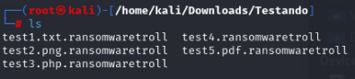

# Desafio de Ransomware


Este repositório foi criado para o desafio de ransomware do Bootcamp de Cibersegurança, com o propósito inicial no código para criptografar e descriptografar um arquivo _.txt_.

Com esta solução, podemos passar um caminho de diretório para que todos os arquivos contidos no mesmo, sejam criptografados.

### Uso

```
git clone https://github.com/katudda/cibersecurity-desafio-ransomware.git

cd cibersecurity-desafio-ransomware
```
Para encriptar os arquivos execute o script **encrypter**:
```
pyhton3 encrypter.py /caminho-diretorio
```

Após executar o script, o diretório com os arquivos ficará parecido com:




Para descriptografar utilizar o script **decrypter**:
```
python3 decrypter.py /caminho-diretorio
```
